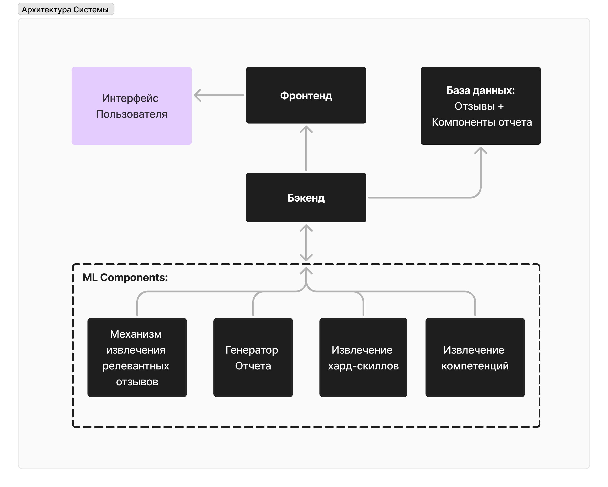

# ScoreWorker - Система анализа обратной связи сотрудников
# Команда - Girlies
**ScoreWorker** — это система анализа обратной связи сотрудников, предназначенная для оценки и генерации сводной информации о сотрудниках на основе отзывов коллег и руководителей. Система построена на базе Django для бэкенда, HTML/CSS/JavaScript для фронтенда, Python для обработки данных и Figma для разработки интерфейса.

## Описание проекта

Основная задача **ScoreWorker** — создание динамичной системы, которая позволяет:
- **Суммировать оценки сотрудников** на основе обратной связи.
- **Оценивать навыки по заданным критериям**.
- **Выделять технические навыки (hard skills)**, указанные в отзывах.
- **Определять общую оценку** сотрудника по шкале от 1 до 5 на основе всех отзывов.

Система использует графическое представление "колесо баланса" для визуализации оценки soft skills и применяет методы машинного обучения для анализа стиля самооценки сотрудника.

---
## Архитектура


## Функциональные возможности

1. **Оценка компетенций**  
   Мы передали большой языковой модели все отзывы и выявили часто встречающиеся компетенции:   
   - Профессионализм
   - Инициативность
   - Решение конфликтов
   - Лидерство
   - Тайм-менеджмент
   - Адаптивность
   - Ответственность
   - Целеустремленность
   - Саморазвитие
   - Коммуникация

2. **Выделение hard skills**  
   На основе обработки естественного языка система извлекает технические навыки, упомянутые в отзывах, исключая soft skills, и возвращает только ключевые профессиональные компетенции.

3. **Анализ самооценки**  
   Система анализирует согласованность самооценки сотрудника с обратной связью от коллег, определяя склонность к чрезмерно положительной или отрицательной самооценке.

4. **Автоматическая генерация краткого резюме**  
   На основе методов обработки естественного языка (NLP) система генерирует краткое резюме производительности сотрудника.

---

## Стек технологий

- **Бэкенд**: Django, Python, SQLite
- **Фронтенд**: HTML, CSS, JavaScript
- **Продвинутые техники больших языковых моделей**: PyTorch, LLM API (llama70B), bart-large-mnli и zero-shot классификаторы, prompt-engineering, embedder (Оценка сотрудника на основе отзывов коллег)
- **Обработка данных**: Python, NLP, transformers (paraphrase-multilingual-MiniLM-L12-v2), кластеризация (KMeans)
- **Дизайн**: Figma

---

## Рабочий процесс

1. **Сбор данных**: Получение отзывов, удаление неинформативных, слишком позитивных или негативных, а так же устранение дополнительных и невидимых символов, чтобы оставить только полезные отзывы.
2. **Обработка данных**:
   - Генерация индивидуальных ID для каждого отзыва
   - Генерация сводного резюме.
   - Выделение soft skills, их оценка, описание, а так же цитата напрямую из отзыва, чтобы увеличить уровень доверия к модели.
   - Выделение hard skills напрямую из отзыва где это возможно.
4. **Анализ**: Дополнительная информация, которую может использовать HR:
   - Система оценивает самооценку сотрудника, сравнивая его отзывы с оценками коллег, и сообщает, нужна ли сотруднику психологическая или другая помощь, а так же курсы повышения квалификации.
   - Можно будет прочитать какой стиль написания фидбэка другим использует сотрудник и стоит ли учитывать его отзывы, если они слишком негативные или позитивные.
6. **Визуализация**: Представление оценок soft skills на круговой диаграмме для наглядного восприятия и подробное описание каждого критерия с ссылкой на отзыв, повлиявший на решение системы в большей степени.
7. **Вывод**: Генерация и сохранение детализированного отчета в формате JSON, который можно отобразить в HTML с использованием CSS.

---

## Визуализация

На нашем сервисе можно увидеть айди или имя сотрудника, его рейтинг, резюме производительности и дополнительную информацию, описанную выше.
Для наглядного представления оценок soft skills используется круговая диаграмма, отображающая значения следующих шагов:
1. Генерация оценок компетенций
2. Построение диаграммы
3. Отображение итогового рейтинга в виде средней оценки по всем компетенциям.
4. Описание компетенций и ссылка на отзыв с цитатой оттуда.
5. Топ отзывов, просортированных в порядке полезности.
---

## Интеграция с API

- **API URL**: Используется для NLP-задач и анализа текста
- **Библиотека requests**: Применяется для выполнения API-запросов, генерации сводок, анализа отзывов и оценки компетенций

---

## Варианты улучшений

- **Дополнительные визуализации**: Добавление временных линий для анализа динамики изменения оценок, чтобы посмотреть улучшились или ухудшились отзывы о сотрудниках с течением времени.
- **Автоматизация отчетности**: Автоматическая генерация и отправка отчетов при добавлении новых отзывов.
- **Обновление отчета по потребности**: Возможность обновлять отчет для отдельного сотрудника, при добавлении новых отзывов только на него без перегенерации всей базы данных.
- **Права доступа и аккаунты**: Админские и пользовательские права, а так же возможность писать отзыв в любому сотруднику в любое время.
---

## Установка и запуск

1. **Склонируйте репозиторий**:
   ```bash
   git clone https://github.com/Chehmet/InnoglobalHack.git
   ```
2. **Подключите API url:**
   
   Создайте файл `.env` в корне проекта и заполните поля ниже
   ```
   DATASET_DIR = ""
   WORKER_DATASET_DIR = ""
   API_URL = ""
   API_URL_BACKUP = ""
   EMBEDDER_URL = ""
   ```
2. **Установите зависимости**:
   ```bash
   pip install -r requirements.txt
   ```
3.  **Запуск ML-сервера**:
   ```bash
   uvicorn ml.src.api:app --reload --port 8001
   ```
4. **Подготовка frontend и backend серверов**:
   ```bash
   cd score_worker
   python manage.py makemigrations
   python manage.py migrate
   ```
5. **Запустите сервер Django**:
   ```bash
   python manage.py runserver
   python manage.py import_employee_data
   ```
6. **Откройте панель управления**: Перейдите по адресу `http://localhost:8000`, чтобы получить доступ к интерфейсу.

---

## Примеры

- **Сгенерированное резюме с одной компетенцией для экономии места**:
   ```json
   {
       "competencies": [{"competency": "Инициативность", "score": 5, "reason": "Отмечена способность брать на себя ответственность и решать задачи", "confirmation": "Не боишься брать на себя ответственность, устойчив к стрессу и терпелив."}],
       "hard skills": ["Программирование", "Аналитика"],
       "score": 4.6
   }
   ```

## Лицензия

Проект распространяется под лицензией MIT.

Для более подробной информации по настройке и дизайну системы, обращайтесь к исходному коду и не стесняйтесь писать разработчикам напрямую:
- **ML-инженеры** - [Чулпан](https://t.me/Chehmet), [Миляуша](https://t.me/mili_sham), [Назгуль](https://t.me/kokosinka123)
- **Backend developer** - [Галия](https://t.me/donna_Kupidona)
- **Frontend developer** - [Любовь](https://t.me/mangocandle)
